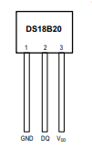

# EmSys_Lab3

In Lab 3 you get to design a low-powered wireless temperature sensor network node. 
You will configure your TinyPico device to read data from a DS18B20 temperature sensor, collect the data, average the data, and then send the data for the central network where it will be rendered on a web page. 
The goal of this project is to make your device consume as little power as possible, so it can last off a battery for as long as possible when deployed in the field.

### Logbook

Similarly to Lab 2 we will use the logbook from Lab 1 for Lab 3. Please do the following to your current git logbook repository:

* Make a directory called ``Lab3/`` in the root directory of your repository
* Make a file ``Lab3/README.md``. This file is where you will write about your experiments and results
* Make a directory ``Lab3/src``. This directory will contain the source code for your various experiments; it is up to you to keep this directory organised and use it to support what you write in ``Lab3/README.md``

### Marking and overall structure

This lab is more open that the previous labs. You will first be asked to develop a working temperature sensor that sends data in a format that the web server can understand. After that you will perform your own experiments to optimise the power consumption of your device. The marks are roughly split like this:

* __[40%]__ get a basic temperature sensor working
* __[60%]__ investigate power saving experiments

Not all of your power saving design experiments will work out, but in the report I want to see evidence that you have thought about things and experimented. It is more the process of experimenting and trying things that I will mark. Also, remember that I am more than happy to chat 1-on-1 or in your groups to discuss your ideas. 

## The temperature sensor



The DS18B20 datasheet can be found [[here](https://datasheets.maximintegrated.com/en/ds/DS18B20.pdf)].

This sensor is a one-wire sensor, meaning that we can just use a single data pin to communicate with it. Don't worry, some libraries are provided to make this a bit easier, and if you do some googling there are plenty of tutorials online detailing how to use this with ESP32s.

The ESP32 and DS18B20s are currently connected in the lab as follows:


* The data line (blue) is connected to GPIO pin 26.
* The power line (red) is connected to the 3.3v output.
* The GND line (black) is connected to the GND pin on the TinyPico.
* A 4.7KOhm pull-up resistor is connected between the data line and the power line.

This wiring setup should be fine for most experiments. However, if you would like to change the wiring for your device to perform an experiment message me and we can discuss it.

### Arduino Libraries

Two libraries will be used for reading the temperature data from the DS18B20 device, `OneWire.h`, and `DallasTemperature.h`. More information on the `DallasTemperature.h` API can be found [[here](https://github.com/milesburton/Arduino-Temperature-Control-Library/blob/master/DallasTemperature.h)]. _There are also many good tutorials online for using the DS18B20 with DallasTemperature.h_. 

For transfering data to the web server, we will be using our homemade library `LetESP32.h`, like in the previous lab. This library has been upgraded with two new methods:

* One for sending JSON data to the websever (see below for more details)
* One for sending binary data to the webserver (see below for more details)


## Data transfer protocol formats 

There are two different formats that you can use to transfer the temperature data from your device to the central server. 

* A JSON based protocol, similar to what you used to send commands for your dotDevice
* A binary protocol 

Each transfer method has a function in ``LetESP32.h`` to help with transfering data.

I would probably recomend starting with the JSON protocol first, and moving onto the binary protocol later when you feel confident.

### JSON based protocol

The standard format to send over your temperature data is via a json format.
This can be constructed using the ``String`` class in a similar fashion to what you did for your dotDevices in lab 1.
However, instead of a small command these JSON strings are a bit longer.

They contain, your unique device name, the average temperature (you must calculate these on your device), and a list of 16 temperature readings. Each of the 16 temperature readings contains a relative timestamp and the associated value for the reading. 

```json
{
   "device": "wibble00",
   "average": 19.4,
   "values":[ 
        {"timestamp" : 1034, "value": 19.5},
        {"timestamp" : 1134, "value": 19.4},
        {"timestamp" : 1234, "value": 19.2},
        {"timestamp" : 1334, "value": 19.4},
        {"timestamp" : 1434, "value": 19.5},
        {"timestamp" : 1534, "value": 19.4},
        {"timestamp" : 1634, "value": 19.2},
        {"timestamp" : 1734, "value": 19.5},
        {"timestamp" : 1834, "value": 19.4},
        {"timestamp" : 1934, "value": 19.2},
        {"timestamp" : 2034, "value": 19.5},
        {"timestamp" : 2134, "value": 19.4},
        {"timestamp" : 2234, "value": 19.2},
        {"timestamp" : 2334, "value": 19.5},
        {"timestamp" : 2434, "value": 19.4},
        {"timestamp" : 2534, "value": 19.2}
  ] 
}
```

To transfer JSON data to the host server use the following `LetESP32.h` method.

```C
LetESP32 tracer(ssid, password, ws, "wibble00");

void loop() {
   tracer.sendJSON(json_str); // where json_str is a String containing the command payload
}
```

### Binary protocol

The binary protocol uses fixed-point notation for the temperature values, and aims to pack the temperature values as tightly as possible to minimise overheads when transferring the data. 

To send the binary protocol data use the following ``LetESP32.h`` method:

```C
LetESP32 tracer(ssid, password, ws, "wibble00");

void loop() {
   tracer.sendBIN(tmp_data);
}
```
